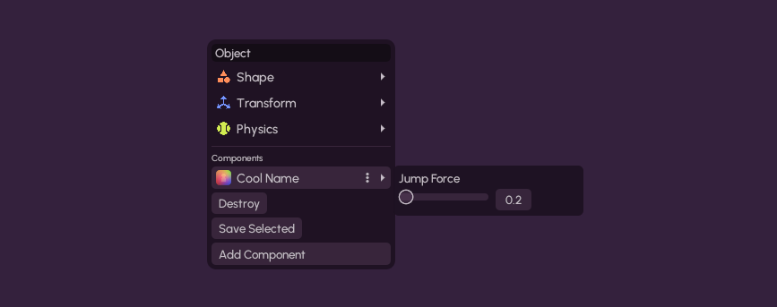

# Component

Components are scripts you place on objects or attachments in Simulo. They're very powerful and allow doing almost anything with scripting, even creating entire games in Simulo.

## Creating Components From Lua

From component code, you can use the [`Scene`](/api/Scene) global to perform most tasks. You also have the `self` variable, which is set to the object/attachment the component is on.

```lua
local box = Scene:add_box({
    position = vec2(0, 0),
    size = vec2(0.5, 0.5),
    color = 0xe5d3b9,
});

local hash = Scene:add_component_def({
    name = "Player",
    id = "@amytimed/test/player",
    version = "0.2.0",

    -- Lua/Luau code to make box "jump" when we press W key
    code = [[
        local host = Scene:get_player(0);

        function on_update()
            if host:key_just_pressed("W") then
                self:apply_linear_impulse_to_center(vec2(0, 1));
            end;
        end;
    ]],
});

box:add_component({ hash = hash }); -- We can reuse the hash on other objects
```

You simply add a new component to the scene with `Scene:add_component_def`, which returns a hash. You can then use `:add_component({ hash = hash })` on objects to apply the script on them.

## Components As Files

If you go into your Simulo folder (**File** → **Open Simulo Folder**), and go into `components` folder, you can create a new folder there. You should pick a nice lowercase name, with underscores instead of spaces, like `my_component`.

Next, add a new file there named `component.toml`. If you're on Windows, you'll need to enable viewing file extensions, see [this page](https://support.microsoft.com/en-us/windows/common-file-name-extensions-in-windows-da4a4430-8e76-89c5-59f7-1cdbbc75cb01). If you're on Mac, use [this guide](https://support.apple.com/en-ca/guide/mac-help/mchlp2304/mac).

Put this in the file:
```toml
[component]
name = "Cool Name"
version = "0.1.0"
```

Now make a `src` folder, and put in a `main.lua`. Inside it, put this:
```lua
local host = Scene:get_player(0);

function on_update()
    if host:key_just_pressed("W") then
        self:apply_linear_impulse_to_center(vec2(0, 1));
    end;
end;
```

Now just reopen Simulo Simulator, and when you click `Add Component` on something, you should see your component. Put it on a box (make sure it's not too heavy) and press W.

But now, how do I add Settings to my component, in the right-click? Well you can just add this at the end of the `component.toml`:
```toml
[[property]]
id = "jump_force"

name = "Jump Force"

input_type = "slider"

default_value = 1.0
min_value = 0.1
max_value = 10.0
```

Now, in `main.lua`, replace this line:

```diff
- self:apply_linear_impulse_to_center(vec2(0, 1));
+ self:apply_linear_impulse_to_center(vec2(0, self_component:get_property("jump_force").value));
```

Now if you save those and restart the game, and add it to a new box, you should see Settings for the component when you right-click and hover over it! If you change it, it should affect how high it jumps.



## Later We Will Have UI

Eventually, the in-game script box will become a pretty good scripting editor where you can make components right there. Wow! But for now you can just use above ways.

## Events

Components have **event handler** functions which are called at certain times, such as `on_update`, which is called each time the physics is updated.

### on_start

This is called when the component is started. It has a `saved_data` argument. When the `on_save` event is called, you can return some data, which will then be passed back into your `on_start` once you load the saved thing.

```lua
local my_data = nil;

function on_start(saved_data)
    my_data = saved_data;
end;

function on_save()
    return my_data;
end;
```

### on_save

As explained in previous section, this is called when we save the component, and what you return here is passed to `on_start` when it starts back up.

### on_update

This is called all the time, even when paused. Listen to it like:

```lua
function on_update()
    -- do stuff all the time here
end;
```

### on_step

This is called each time the physics is updated, so only when unpaused. This is currently `64` times per second.

```lua
function on_step()
    -- do stuff here
end;
```

You can also take a `time_step` argument, which will be equal to `1.0 / 64.0`.

### on_event

This function is called whenever there's a `:send_event` called on the object/attachment or its components. It gets two parameters: an event ID, and the data of the event.

You can listen to it like:

```lua
function on_event(id, data)
    if id == "property_changed" then -- this is an event sent by Simulo itself
        -- my component properties changed omg
        -- (do something here idk)
    elseif id == "some_custom_event" then
        -- if we do `:send_event("some_custom_event", "wow omg")`, then this code will run, with `data` set to `"wow omg"`
        print(data);
    end;
end;
```

### on_collision_start

When it starts touching something. If it started touching it before the component was started, you won't get this, so use `object:get_touching()` if you're looking to see everything.

```lua
function on_collision_start(data)
    -- we have data.other (object)
    -- and data.points. latter isnt the most reliable
end;
```

It might give you an on_collision_start before they start touching. This is because Box2D is haunted

### on_collision_end

When it stops touching and returns to isolation, we get this. It has a `data` too but only `data.other`, not points

```lua
function on_collision_end(data)
    -- data.other is the other obj
end;
```

### on_sensor_enter

Behold the untested sensorizing. When you add a shape, set `is_sensor = true`. Now it won't collide normally it's just a sensor. Wow! I don't know if it'll even let you drag it, so be carefuls I guess

```lua
function on_sensor_enter(other)
    -- i think this is called on both the sensor and the object. i honestly know nothing
end;
```

### on_sensor_exit

```lua
function on_sensor_exit(other)
    -- Wow!
end;
```

### on_hit

This one is really cools. It gets a `data` with `data.other`, `data.point`, `data.normal`, `data.approach_speed`. Who knows if it works

You could use it for making collision sounds before me

```lua
function on_hit(data)
    -- aforementioned properties available here
end;
```

### on_destroy

This function is called when the object is about to be destroyed. When it is called, the object is still completely intact.

```lua
function on_destroy()
    print("I am going to die");
end;
```

# Component API

In a component, we have the `self_component` variable. This is similar to `self`, but instead of being the object/attachment, it's the component itself.

We can use it to get the component properties. We can also obtain these from `Scene:get_component`, and `:destroy()` them, or call `:send_event` directly on a component instead of an object if we want.

Below are the fields and functions on a `Component`, such as `self_component`.

## Fields

---

### .id

Identifier for the component. Is a <Type name="number" />.

---

### .hash

The hash of the component's definition. Is a <Type name="string" />.

## Functions

:::note
Make sure to use `:function()` and not `.function()`, or you'll get an error
:::

---

### \:destroy()

Destroys this component, removing it from its parent object or attachment

---

### \:is_destroyed()

Returns whether this component has been destroyed

---

### \:get_property()

Gets a property value by ID. It is a table, and the value of the property will be in `.value`.

---

### \:get_properties()

Gets all properties as a table

---

### \:set_property()

Sets a property value. It'll send_event with id "property_changed" and data being the property id.

The way you should usually use this is, call `:get_property` and store the entire table, then just change the `value`, and call this with that table.

#### Example
```lua
local prop = self_component:get_property("jump_force");
prop.value = 1;
self_component:set_property("jump_force", prop);
```

---

### \:send_event()

Sends an event to the component. It will call its `on_event`. If it returns data, then this `send_event` returns that. Conversely, if you call `send_event` on an object, no data is returned.

#### Example
```lua
component:send_event("some_event_id", 3); -- second argument is the data. you can use almost anything as the data, other than functions
```

