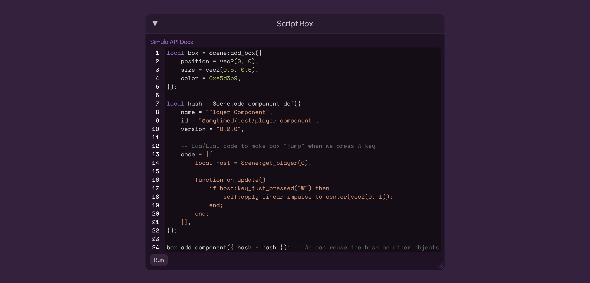

import Type from "@site/src/components/Type";

# API Docs Introduction

Welcome to the Simulo API Docs! From here, you can learn all about the various parts of Simulo's Luau scripting API.

These docs currently assume an understanding of Lua fundamentals. If you're not familiar with Lua, please follow a Lua tutorial first, then come back here when you're ready. You may however still be able to follow if you're familiar with programming in general.

If you're here to see examples, you should check out the [Samples](../../samples/intro) as well.

---

## Getting Started

Currently, Simulo scripting is entirely done through the **Script Box**. By the time Simulo has a public release, this will have been replaced by proper scripting UI, but for now, this is where you write scripts.



### Script Box Features

The Simulo Script Box has the following features:

-   ✅ Luau syntax highlighting
-   ✅ Line numbers
-   ✅ Display of runtime logs and errors

The Simulo Script Box does **NOT** currently have the following features:

-   ⛔ Static analysis
-   ⛔ IntelliSense
-   ⛔ Multiple files

### Your First Script

The Script Box runs one-shot global scripts on the scene. This means we run the code in the script once, in contrast to [Components](#components), which can run code every `Update`.

```lua
print("Hello, worlds!"); -- The string shows up in the Script Box's output
```

### Vec2

Simulo uses <Type name="vec2" /> all over the API to represent positions, sizes, velocities, etc. A <Type name="vec2" /> has 2 fields: `x` and `y`. We create them using the `vec2(x, y)` global constructor:

```lua
local vec = vec2(5, 5); -- Creates a new Vec2 with `x` and `y` set to 5

print(tostring(vec)); -- (5, 5)
```

We can perform most math operations on a <Type name="vec2" />:

```lua
local a = vec2(1, 0);
local b = vec2(0, 1);

-- Addition
print(tostring(a + b)); -- (1, 1)
-- Subtraction
print(tostring(a - b)); -- (1, -1)
-- Multiplication
print(tostring(a * 2)); -- (2, 0)
-- Division
print(tostring(a / 2)); -- (0.5, 0)
-- Negation
print(tostring(-a)); -- (-1, 0)
```

<Type name="vec2" /> also has a `:magnitude()` function:

```lua
-- We have to use `:` and not `.` here!
local vec = vec2(1, 1);
print(vec:magnitude()); -- 1.41421...

-- more Vec2 functions coming soon
```

### Why `:` instead of `.`?

Someone very new to Lua might wonder why we have to use `:` instead of `.` to call the `magnitude()` function on a <Type name="vec2" />, as in most programming languages that isn't the case.

The answer is, the `:` operator passes the <Type name="vec2" /> into the function as a hidden parameter. Here's an example:

```lua
local vec = vec2(0, 0);

-- Writing this:
vec:magnitude();
-- Is the same as writing this:
vec.magnitude(vec);

-- The first one passes in itself as a hidden parameter to the `magnitude` function,
-- and in the second one, we use `.` (which doesn't do that) but we manually pass in `vec`.

-- Thus, if we try to use `.` without passing in `vec`, we will get an error.
vec.magnitude(); -- ⛔ This will cause an error
```

### Adding Boxes

We can add boxes to the scene with the `Scene:add_box` function. It takes a table with fields like position, size, etc.

```lua
-- Add a red box to the scene

Scene:add_box({
    position = vec2(0, 0),
    size = vec2(1, 1),
    is_static = false, -- Should the box be "glued to the background"?
    color = 0xff0000, -- Hex color
});
```

If you paste this code in Simulo's Script Box and press `Run`, you should see a red box appear. If the game isn't paused, it will fall to the ground.

`Scene:add_box` returns a `SimuloObject`. We can store this in a variable:

```lua
local box = Scene:add_box({
    position = vec2(0, 0),
    size = vec2(1, 1),
    is_static = false,
    color = 0xff0000,
});

box.color = 0x00ff00; -- Change color to green after creating
```

Running the above code should produce a green box, even though we initially made it red.

### Rest Of The Owl

Now you may have some questions about how to accomplish specific things in the API, such as getting a reference to a specific object in the scene, getting a list of all the objects in the scene, etc.

You can find all the Scene API functions in the [Scene section of the API Docs](../scene/).

---

## Components

As said earlier, the Simulo Script Box can only run one-shot scripts. However, Simulo also provides Components, which allow placing scripts on objects, such as boxes, polygons, circles, etc.

Components are very powerful and allow doing almost anything with scripting, even creating a platformer game in Simulo.

For a guide on how to use components, check out the [Components section of the API Docs](../components/).