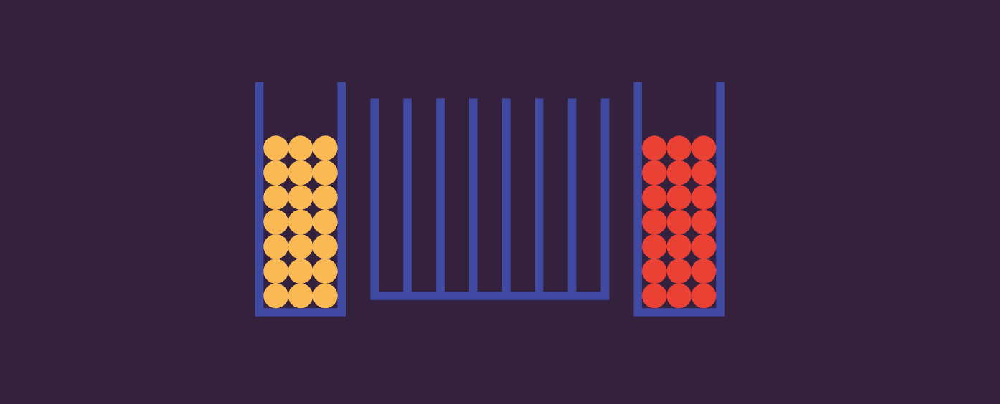

# Connect 4

Here's a popular board game recreated in Simulo by Jorin!



```lua
Scene:reset();

function wall(x,y,sx,sy)
    Scene:add_box({
        position = vec2(x, y),
        size = vec2(sx, sy),
        color = 0x404aa3,
        body_type = BodyType.Static,
    });
end;

function makeBoard()
    for i=-3, 4 do
        wall(2*i-1,0,0.25,6)
    end;
    wall(0,-6,7.25,0.25)
    for i=-1, 1, 2 do
        wall(9*i,0,0.25,7)
        wall(14*i,0,0.25,7)
        wall(11.5*i,-7,2.75,0.25)
    end;
    for i=1, 21 do
        Scene:add_circle({
            position = vec2(11.5,2*i),
            radius = 0.75,
            body_type = BodyType.Dynamic,
            color = 0xeb4034,
        })
    end;
    for i=1, 21 do
        Scene:add_circle({
            position = vec2(-11.5,2*i),
            radius = 0.75,
            body_type = BodyType.Dynamic,
            color = 0xfbb954,
        })
    end;
end;

makeBoard()
```
