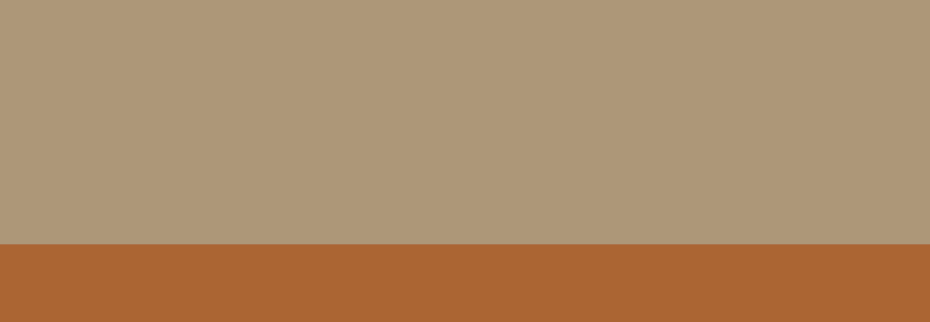

# Themes

We can create themes using scripts! Remember to run the `reset` function after defining it, or nothing will happen. We simply provide them without running them for convenience in copy-pasting them.

## Earth Theme

```lua
function reset()
    local ground_color = 0x4d9c0b;
    local background_color = 0x80bfff;

    Scene.background_color = background_color;

    local objs = Scene:get_all_objects();
    for i=1,#objs do
        objs[i]:destroy();
    end;

    Scene:set_gravity(vec2(0, -9.805))

    -- Ground
    Scene:add_box({
        position = vec2(0, -120),
        size = vec2(1000, 100),
        color = ground_color,
        is_static = true,
    });
end;
```


## Mars Theme

```lua
function reset()
    local ground_color = 0xab6533;
    local background_color = 0xad9778;

    Scene.background_color = background_color;

    local objs = Scene:get_all_objects();
    for i=1,#objs do
        objs[i]:destroy();
    end;

    Scene:set_gravity(vec2(0, -9.805))

    -- Ground
    Scene:add_box({
        position = vec2(0, -120),
        size = vec2(1000, 100),
        color = ground_color,
        is_static = true,
    });
end;
```



## Space Theme

This one also changes gravity

```lua
function reset()
    local objs = Scene:get_all_objects();
    for i=1,#objs do
        objs[i]:destroy();
    end;
    Scene:set_gravity(vec2(0, 0));
    Scene.background_color = 0x000000;
end;
```

